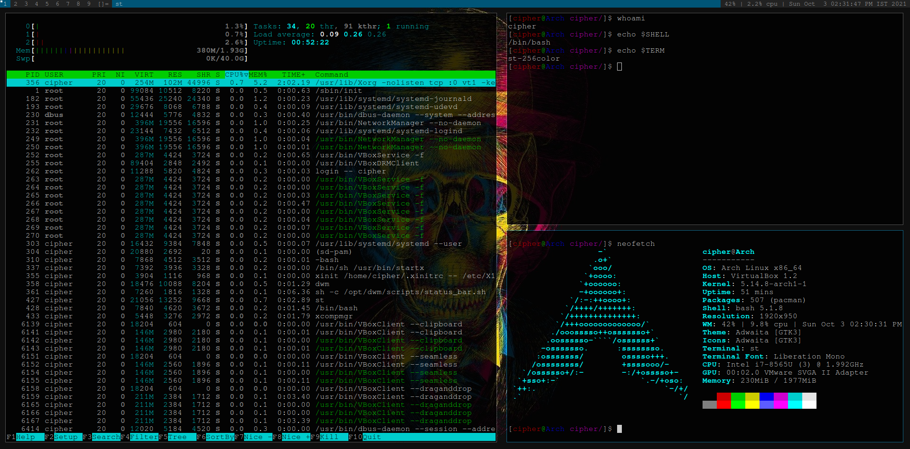

# st

This is my customized version of Simple Terminal (st) by suckless.org . There are only three patches applied to this software, alpha, scrollback, and alpha-focus.
You can get my custom .bashrc file [here](https://gist.github.com/Cipher7/3a22688aec923237637c2c08dc417f3a), 
and my custom .vimrc [here](https://gist.github.com/Cipher7/9b27a13089ddf3a48b087f83e8f3f28d). The window manager used by me is dwm for which I have a custom
patched version [here](https://github.com/Cipher7/dwm/)
The font size is also changed from 12 to 16. If you have any queries or suggetions, you can contact me on either [Discord](https://discordapp.com/users/706779776349765722) or [Twitter](https://twitter.com/xCipher007).

#Screenshots

